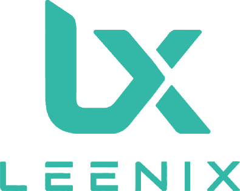

  

  <strong>A modular, declarative and reproducible NixOS framework.</strong>

  Built with NixOS, Flakes, Home Manager, Hyprland and a questionable desire to configure absolutely everything.

⸻

What is LEENIX?

LEENIX is my declarative NixOS configuration and framework for building reproducible Linux systems.

The idea is simple:

HOST → PROFILE → MODULE → IMPLEMENTATION

A machine defines what it is and what it needs.

Profiles compose capabilities.

Modules implement them.

Nix does the rest.

Instead of maintaining a giant machine-specific configuration, LEENIX is designed so that adding another laptop, desktop, server, VM or ARM machine mostly means defining its variables and selecting the capabilities it should have.

Philosophy

LEENIX follows a few rules:

* Nix is the source of truth
* Machine-specific policy belongs to the host
* Reusable logic belongs in modules
* Profiles compose capabilities instead of duplicating them
* System configuration and user configuration stay separated
* Generated configuration is treated as an artifact
* Secrets never belong in the repository
* Hosts should stay small
* Components should remain independently enableable
* Rebuilds should be reproducible

Architecture

leenix/
├── flake.nix
├── flake.lock
│
├── hosts/
│   └── tuf-f15/
│       ├── default.nix
│       ├── hardware-configuration.nix
│       └── variables.nix
│
├── profiles/
│   ├── base.nix
│   ├── desktop.nix
│   ├── laptop.nix
│   └── gaming.nix
│
├── modules/
│   ├── nixos/
│   │   ├── boot/
│   │   ├── core/
│   │   ├── desktop/
│   │   ├── disk/
│   │   ├── hardware/
│   │   ├── memory/
│   │   ├── networking/
│   │   ├── security/
│   │   └── services/
│   │
│   └── home/
│       ├── desktop/
│       ├── hyprland/
│       ├── programs/
│       ├── scripts/
│       ├── services/
│       ├── shell/
│       ├── terminal/
│       ├── theme/
│       └── ui/
│
├── disks/
├── home/
├── lib/
├── dotfiles/
└── system/

Host configuration

Each machine owns a variables.nix file containing its identity and policy.

For example:

hosts/tuf-f15/variables.nix

This is where host-specific choices belong:

hostname
architecture
username
timezone
locale
keyboard
desktop
profiles
disk layout
networking
GPU
power policy
authentication
SSH policy
services

Implementation stays outside the host.

This makes it possible to introduce another machine without copying the entire configuration.

leenix.*

Reusable functionality is exposed through custom NixOS options under the leenix namespace.

Conceptually:

leenix.hardware.nvidia.enable = true;
leenix.networking.iwd.enable = true;
leenix.memory.zram.enable = true;
leenix.desktop.gaming.enable = true;

This keeps capabilities composable while allowing host policy to remain centralized.

Desktop

The desktop environment is based around Hyprland and is managed declaratively through Home Manager.

LEENIX currently manages components including:

Hyprland
Waybar
Hyprlock
Hypridle
Hyprsunset
Mako
Walker
SwayOSD
Kitty
Yazi
Zsh
Tmux
Neovim
wallpapers
clipboard tools
screenshots
screen recording

Hyprland itself is split by responsibility instead of living inside one enormous configuration.

Storage

The laptop storage layout uses:

GPT
 ├── EFI
 └── LUKS2
      └── BTRFS

Storage definitions live separately under:

disks/

allowing disk layouts to be reused independently from host configuration.

Boot

LEENIX includes declarative boot configuration with:

* Limine support
* custom LEENIX/Leenium styling
* Plymouth
* encrypted-root boot flow

The intended boot path is roughly:

UEFI
  ↓
Limine
  ↓
Linux + initrd
  ↓
Plymouth
  ↓
LUKS unlock
  ↓
systemd
  ↓
UWSM
  ↓
Hyprland

Hardware

Hardware support is kept modular.

Current configuration includes support for components such as:

Intel
NVIDIA
hybrid graphics
ASUS laptop features
Bluetooth
power profiles
ZRAM

Hardware implementation does not belong inside generic desktop or laptop profiles.

Networking

Networking capabilities are also independently configurable, including:

iwd
DNS
Tailscale
WireGuard
OpenVPN

Network policy remains host-specific while implementation stays reusable.

Gaming

LEENIX contains a dedicated gaming profile and NixOS gaming module.

The gaming stack is designed around technologies such as:

Steam
Proton
GameMode
Gamescope
MangoHud
NVIDIA PRIME
Vulkan

so gaming configuration can be enabled as a capability rather than being mixed into the base system.

Home Manager

System configuration and user configuration have intentionally different responsibilities.

modules/nixos/

owns things such as:

boot
kernel
hardware
storage
networking
security
system services

while:

modules/home/

owns the user environment:

Hyprland
Waybar
terminal
shell
applications
themes
scripts
desktop utilities

Rebuilding

A normal system rebuild uses:

sudo nixos-rebuild switch --flake .#<host>

For the current laptop:

sudo nixos-rebuild switch --flake .#tuf-f15

The repository also contains a Makefile for common development and validation operations.

Before activating major changes:

nix flake check

and build first when appropriate.

Adding another machine

The long-term goal of LEENIX is for adding another system to mostly look like this:

1. Create hosts/<host>/
2. Define variables.nix
3. Add hardware configuration
4. Select profiles
5. Select a disk layout
6. Build/install

The implementation should already live in reusable modules.

No giant copy-pasted configuration.nix.

Status

LEENIX is under active development.

It currently represents my actual NixOS environment rather than a polished general-purpose distribution, so interfaces, modules and layouts may change while the architecture evolves.

Use it as inspiration, steal useful modules, or break it in interesting ways.

⸻

  <strong>LEENIX</strong> 
  Declare it. Build it. Reproduce it.

