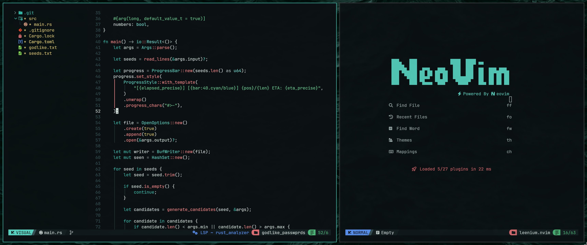

<div align="center">

# tired.nvim

**A local Neovim config built around the Leenium palette and vendored framework code.**

Hosted under `github.com/drunkleen/tired.nvim`.



</div>

---

## Features

- Local `base46` theme engine
- Local `volt` floating window helpers
- Vendored framework code, renamed for this config
- `leenium` as the default theme
- Theme picker, dashboard, cheatsheet, terminal, notifier, and LSP setup are all local
- Scope guides use `mini.indentscope` alongside `indent-blankline`
- Out-of-box support for common languages, templates, formatters, and linters

---

## Installation

### Local config

```bash
git clone https://github.com/drunkleen/tired.nvim ~/.config/nvim
```

Set your Neovim config directory to `~/.config/nvim` or this repo path.

---

## Usage

- Start Neovim normally.
- The dashboard appears on empty startup.
- Open the theme selector with `<leader>th`.
- Save with `<C-s>` to write and notify.

---

## Keybindings

### Editing

| Mode | Keys | Action |
|---|---|---|
| Insert | `<C-b>` | Move to line start |
| Insert | `<C-e>` | Move to line end |
| Insert | `<C-h>`, `<C-j>`, `<C-k>`, `<C-l>` | Move cursor |
| Normal | `<C-h>`, `<C-j>`, `<C-k>`, `<C-l>` | Window navigation |
| Normal | `<Esc>` | Clear search highlights |
| Normal | `<C-s>` | Save file and notify |
| Normal | `<C-c>` | Copy whole file |
| Normal | `<leader>/` | Toggle comment |
| Visual | `<leader>/` | Toggle comment |
| Normal | `<leader>fm` | Format file |
| Normal | `<leader>n` | Toggle line numbers |
| Normal | `<leader>rn` | Toggle relative numbers |

### Navigation

| Mode | Keys | Action |
|---|---|---|
| Normal | `<C-n>` | Toggle file tree |
| Normal | `<leader>e` | Focus file tree |
| Normal | `<leader>fw` | Live grep |
| Normal | `<leader>ff` | Find files |
| Normal | `<leader>fa` | Find all files |
| Normal | `<leader>fb` | Find buffers |
| Normal | `<leader>fh` | Help tags |
| Normal | `<leader>fo` | Old files |
| Normal | `<leader>fz` | Fuzzy find in buffer |
| Normal | `<leader>cm` | Git commits |
| Normal | `<leader>gt` | Git status |
| Normal | `<leader>pt` | Hidden terminals |

### Buffers and UI

| Mode | Keys | Action |
|---|---|---|
| Normal | `<tab>` / `<S-tab>` | Cycle buffers |
| Normal | `<leader>b` | Open new buffer |
| Normal | `<leader>x` | Close current buffer |
| Normal | `<leader>ch` | Open cheatsheet |
| Normal | `<leader>th` | Open theme selector |
| Normal | `<leader>wK` | Show all keymaps |
| Normal | `<leader>wk` | Query keymaps |
| Normal | `<leader>ds` | Diagnostic loclist |

### Terminal

| Mode | Keys | Action |
|---|---|---|
| Terminal | `<C-x>` | Exit terminal mode |
| Normal | `<leader>-v` | Open vertical terminal |
| Normal / Terminal | `<leader>h` | Toggle horizontal terminal |
| Normal / Terminal | `<leader>\` | Toggle floating terminal |

---

## Commands

| Command | Purpose |
|---|---|
| `:TiredDash` | Toggle the dashboard |
| `:TiredCheatsheet` | Open the cheatsheet |
| `:MasonInstallAll` | Install detected external tools |
| `:TSInstallAll` | Install all configured Treesitter parsers |
| `:WhichKey` | Show keybinding help |

---

## Notes

- Filetypes, indent defaults, LSPs, formatters, and linters live in `lua/tired/`.
- Template files are handled by `djlint`, `jinja_lsp`, `templ`, `htmx`, and `html` where appropriate.
- Django, Jinja, Go template, Twig, Nunjucks, Handlebars, Mustache, and `templ` files are detected via local filetype rules.
- The theme stack is local; `leenium` is defined in `lua/base46/themes/leenium.lua`.

---

## License

MIT © [Leenium](LICENSE)
